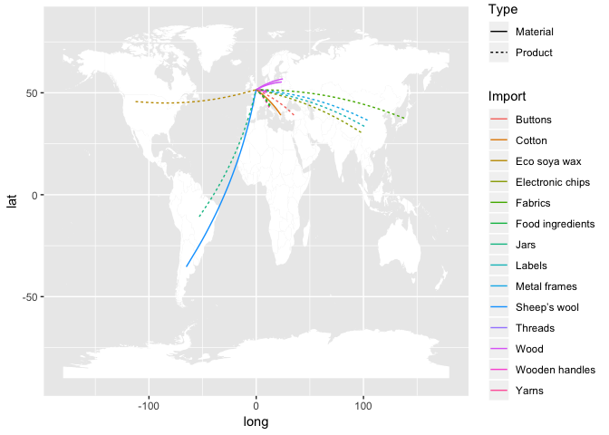
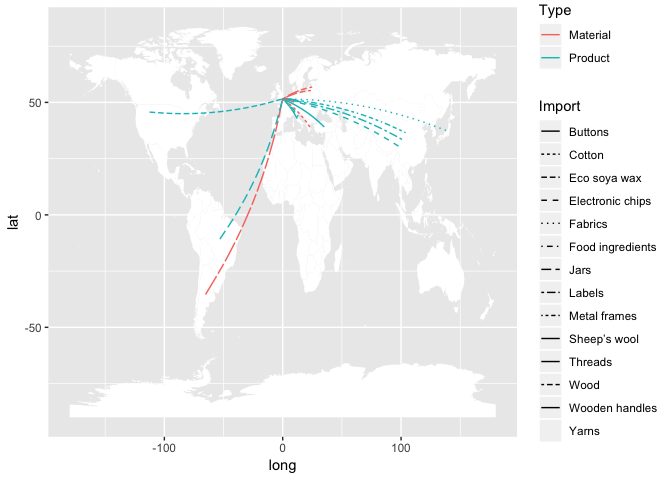
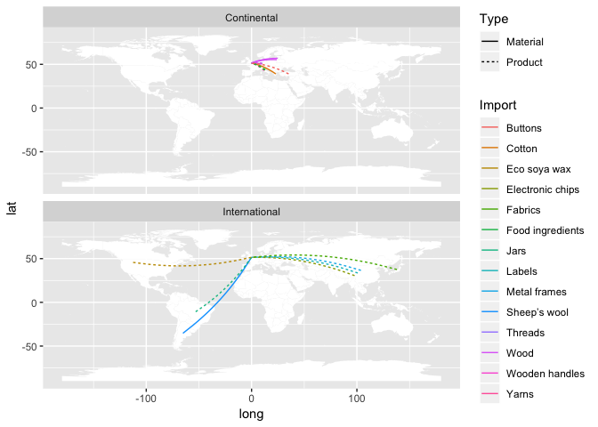
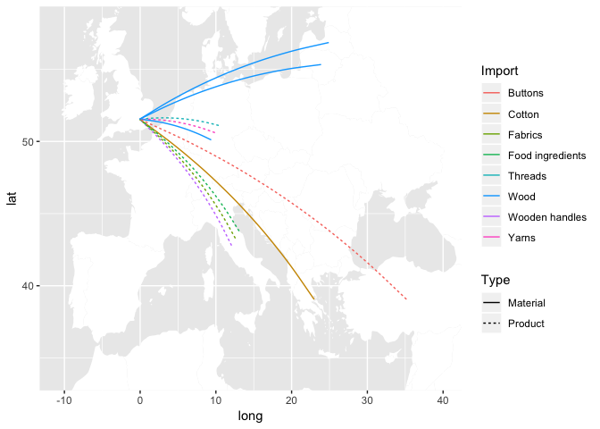
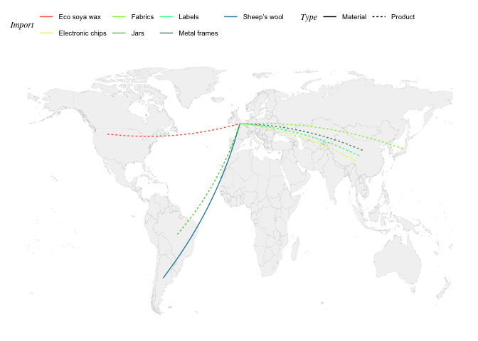
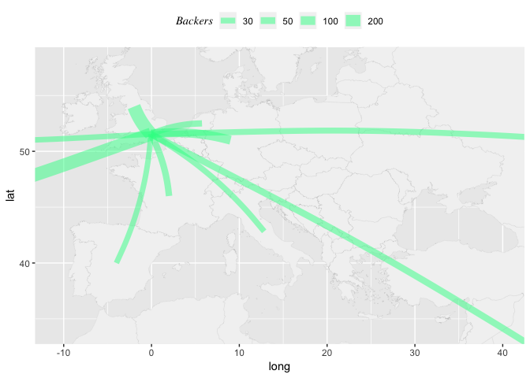
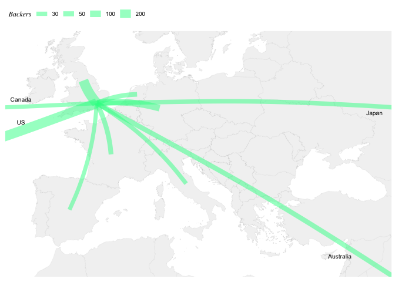

Flowmap
================
NP
25/10/2018

Vyner Street geography of imports
---------------------------------

This is a log to register the process of creating a geographic-connections-map of imports. The purpose of this visualisation is to illustrate the inputs of the 'geography of production' of the firms interviewed for the 'Vyner Street' case study in Hackney in the context of the \[Cities of Making\]<http://citiesofmaking.com/> project.

------------------------------------------------------------------------

URLs visited for reference:
- <https://github.com/rafapereirabr/flow-map-in-r-ggplot/blob/master/Flow%20Map%20in%20R.R>
- <https://gis.stackexchange.com/questions/71921/list-of-central-coordinates-for-all-countries/71958>
- <https://www.r-graph-gallery.com/192-ggplot-themes/>
- <https://flowingdata.com/2011/05/11/how-to-map-connections-with-great-circles/>

------------------------------------------------------------------------

###### Packages and Libraries

``` r
# Packages
#install.packages("rworldmap")
#install.packages("mapproj")
#install.packages("rworldxtra")

# Libraries
library(maps)
library(geosphere)
library(dplyr)
library(ggplot2)
library(rworldmap)
library(plyr)
library(data.table)
library(ggthemes)
library(rgeos)
library(readr)
library(data.table)
library(mapproj)
library(tmap)
library(rworldxtra)
```

#### Part I: Prepare de dataset

###### 1. ç 'From' and 'To' information

``` r
Mwf <- read_csv("/Volumes/ucfnnap-1/COM/material_world_flow.csv")
```

###### 2. Get worldmap (from rworldmap library) and get centroids

``` r
# get world map
wmap <- getMap(resolution="high")
# get centroids
centroids <- gCentroid(wmap, byid=TRUE)
```

###### 3. Get a dataframe with centroids

``` r
# get a data.frame with centroids
cent <- as.data.frame(centroids)
head(cent)
```

    ##                     x         y
    ## Aruba       -69.97345  12.51678
    ## Afghanistan  66.00845  33.83627
    ## Angola       17.53646 -12.29118
    ## Anguilla    -63.06082  18.22560
    ## Albania      20.05399  41.14258
    ## Aland        20.03715  60.20733

###### 4. Convert rownames 'rn' into a variable

``` r
# convert rownames into variable 
setDT(cent, keep.rownames = TRUE)[]
```

    ##                rn          x         y
    ##   1:        Aruba  -69.97345  12.51678
    ##   2:  Afghanistan   66.00845  33.83627
    ##   3:       Angola   17.53646 -12.29118
    ##   4:     Anguilla  -63.06082  18.22560
    ##   5:      Albania   20.05399  41.14258
    ##  ---                                  
    ## 249:        Samoa -172.16028 -13.75468
    ## 250:        Yemen   47.59093  15.90515
    ## 251: South Africa   25.08773 -29.00105
    ## 252:       Zambia   27.77421 -13.46011
    ## 253:     Zimbabwe   29.85188 -19.00254

###### 5. Merge 'Wmf' with 'cent' dataframe by the columns that contain country names 'From' and 'rn'. Verify that the names of the countries are equally spelled. Check the number of observations in your 'joined' object.

``` r
# merge material_world_flow with centroids
odm <- merge(Mwf, cent, by.x="From", by.y="rn", all.x=T)
head(odm)
```

    ##        From           Import      To  x.x  y.x     yend     xend     Type
    ## 1 Argentina     Sheep’s wool Hackney <NA> <NA> 51.54032 -0.06039 Material
    ## 2    Brazil             Jars Hackney <NA> <NA> 51.54032 -0.06039  Product
    ## 3     China     Metal frames Hackney <NA> <NA> 51.54032 -0.06039  Product
    ## 4   China 1           Labels Hackney <NA> <NA> 51.54032 -0.06039  Product
    ## 5   China 2 Electronic chips Hackney <NA> <NA> 51.54032 -0.06039  Product
    ## 6   Germany          Threads Hackney <NA> <NA> 51.54032 -0.06039  Product
    ##          Region       x.y       y.y
    ## 1 International -65.17822 -35.38270
    ## 2 International -53.09397 -10.78278
    ## 3 International 103.82491  36.56128
    ## 4 International        NA        NA
    ## 5 International        NA        NA
    ## 6   Continental  10.38155  51.10621

###### 6.Delete empty columns by index (4,5)

``` r
# specify columns to remove with negative index
odm <- odm[, -c(4, 5)]
```

###### 7. Given that some countries were repeated (same centroid) and we would want our connections not to overlap, we named those countries as 'subsidiaries'. Therefore, after the merge in point 5. the 'x' and 'y' fields remained empty (NA). We now need to get the coordinates for this location (or destination) in columns 'x.y' (long) and 'y.y' (lat). The code checks the name of the country and asigns a value to the respective cell (based on the 'parent' country). Now our dataset is complete.

``` r
odm$x.y[odm$From == "China 1"] <- odm$x.y[odm$From == "China"]-3
odm$y.y[odm$From == "China 1"] <- odm$y.y[odm$From == "China"]-3
odm$x.y[odm$From == "China 2"] <- odm$x.y[odm$From == "China"]-6
odm$y.y[odm$From == "China 2"] <- odm$y.y[odm$From == "China"]-6

odm$x.y[odm$From == "Germany 1"] <- odm$x.y[odm$From == "Germany"]-0.5
odm$y.y[odm$From == "Germany 1"] <- odm$y.y[odm$From == "Germany"]-0.5
odm$x.y[odm$From == "Germany 2"] <- odm$x.y[odm$From == "Germany"]-1
odm$y.y[odm$From == "Germany 2"] <- odm$y.y[odm$From == "Germany"]-1

odm$x.y[odm$From == "Italy 1"] <- odm$x.y[odm$From == "Italy"]+0.5
odm$y.y[odm$From == "Italy 1"] <- odm$y.y[odm$From == "Italy"]+0.5
odm$x.y[odm$From == "Italy 2"] <- odm$x.y[odm$From == "Italy"]+1
odm$y.y[odm$From == "Italy 2"] <- odm$y.y[odm$From == "Italy"]+1
```

#### Part II. Create a simple map using Curve Line

###### 8. Get worldmap from library 'rworldxtra' to use as a 'basemap' (with high resolution). Then convert to dataframe with the 'fortify' function.

``` r
worldMap <- getMap(resolution = "high")
mapworld_df <- fortify(worldMap)
```

    ## Regions defined for each Polygons

``` r
class(mapworld_df)
```

    ## [1] "data.frame"

###### 9. Create a test plot for Europe. First, get the boundingbox to determine the 'xlim' and 'ylim' of the plot. This URL will help <https://boundingbox.klokantech.com/> .Copy the geojson to get the coordinates to create the 'xlim1' and 'ylim1' objects.

``` r
# [[[-10.8421722152,34.0420631631],[45.1606791686,34.0420631631],[45.1606791686,59.3006822903],[-10.8421722152,59.3006822903],[-10.8421722152,34.0420631631]]]
xlim1 <- c(-23.3537208175, 51.9816177994)
ylim1 <- c(30.0673444226, 61.7436916491)
eu <- map("world", col="white", fill=TRUE, bg="#f2f2f2", lwd=0.05, xlim=xlim1, ylim=ylim1)
```


###### 10. Before we continue we'll get another worldmap with less resolution to use when ploting tests and save time.

``` r
L_worldMap <- getMap(resolution = "low")
L_mapworld_df <- fortify(L_worldMap)
```

###### 11. To creat a map we use ggplot() to plot the 'basemap' layer and the 'connections' in the 'odm' dataset. The 'basemap' layer will be a geom\_polygon object and the 'connections' a geom\_curve. Line colour and type are set according to 'Import' and 'Type' respectively.

``` r
conn <- geom_curve(data = odm, aes(x = x.y, y = y.y, xend = xend, yend = yend, color=Import, linetype=Type), curvature = 0.1)
bmap <- geom_polygon(data= L_mapworld_df, aes(long,lat, group=group), fill="white")

ggplot() + bmap + conn
```



###### 12. Let's try interchanging color and linetype.

``` r
conn_v <- geom_curve(data = odm, aes(x = x.y, y = y.y, xend = xend, yend = yend, color=Type, linetype=Import), curvature = 0.1)

ggplot() + bmap + conn_v
```



###### 13. The maps show a general view of the materials and products import, being the first one a bit more clearer. But to be able have a more precise differentiation of the materials we'll try to create maps according to 'Region' using the facet\_wrap() function.

``` r
ggplot() + bmap + conn + facet_wrap(~Region, dir = "v")
```



###### 14. Another alternative is to create two separate maps with basemaps according to the geographical extent of the 'Region'. To do that we subset the dataset accordingly and create two new dataframes.

``` r
odm_cont <- odm[odm$Region == "Continental",]
odm_int <- odm[odm$Region == "International",]
```

###### 15. Let's try creating the 'Continental' map. To 'zoom in' to the 'Region' of interest we create the 'xlim2' and 'ylim2' that we'll set using the coord\_cartesian() function.

``` r
xlim2 <- c(-10.7306956086, 39.9190882164)
ylim2 <- c(33.9565350786, 58.1373679576)

conn_cont <- geom_curve(data = odm_cont, aes(x = x.y, y = y.y, xend = xend, yend = yend, color=Import, linetype=Type), curvature = 0.1)
bmap <- geom_polygon(data= L_mapworld_df, aes(long,lat, group=group), fill="white")

ggplot() + bmap + conn_cont + coord_cartesian(xlim=xlim2, ylim=ylim2)
```



###### 16. Now, it is possible to see, for example, that cotton comes from Greece. We can now improve the aesthetics of the map. We'll start by creating our own color palettes.

``` r
com6=c("#ffeb28","#85db49","#2bfd94","#66aa93","#358189","#2c576f")
com8=c("#ff6347","#e2fa5b","#96ee42","#60c854","#2bfd94","#668e81","#358daf","#5c47cf")

# Function for plotting colors side-by-side
pal <- function(col, border = "light gray", ...){
  n <- length(col)
  plot(0, 0, type="n", xlim = c(0, 1), ylim = c(0, 1),
       axes = FALSE, xlab = "", ylab = "", ...)
  rect(0:(n-1)/n, 0, 1:n/n, 1, col = col, border = border)
}

pal(com6)
```


``` r
pal(com8)
```


###### 17. We can use the theme\_map() to quickly assign a 'maplike' style to our plot. We'll also customize our geom\_polygon to create a better basemap and we'll use the scale\_colour\_manual() function to apply our palettes.

``` r
bmap <- geom_polygon(data= mapworld_df, aes(long,lat, group=group), fill="grey95", colour="grey65", size=0.03)

ggplot() + bmap + conn_cont + coord_cartesian(xlim=xlim2, ylim=ylim2) + 
  theme_map() + 
  scale_color_manual(values = com8) + 
  theme(legend.position="top", legend.title = element_text(face = "italic", family = "serif"))
```


###### 18. Next we can create the 'International' map with similar aesthetics. We also use the function coord\_equal to improve the look of the map

``` r
conn_int <- geom_curve(data = odm_int, aes(x = x.y, y = y.y, xend = xend, yend = yend, color=Import, linetype=Type), curvature = 0.1)

ylim3 <- c(-60, NA)

L_bmap <- geom_polygon(data= L_mapworld_df, aes(long,lat, group=group), fill="grey95", colour="grey65", size=0.03)

ggplot() + L_bmap + conn_int + coord_cartesian() + ylim(ylim3) +
  theme_map() + 
  scale_color_manual(values = com8) + 
  theme(legend.position="top", legend.title = element_text(face = "italic", family = "serif")) +
  coord_equal()
```

    ## Coordinate system already present. Adding new coordinate system, which will replace the existing one.



### Section Two

In this section we'll anaylise the market of the ['Smartibot'](https://www.kickstarter.com/projects/460355237/smartibot-the-worlds-first-ai-enabled-cardboard-ro?ref=nav_search&result=project&term=smartibot), a high-tech product that was designed and prototyped in 'Machines Room'.

###### Preparing the data

###### 1. We collected the data on the top 10 backers's countries from the project website on kikstarter. Load .csv files with this information

``` r
sbb <- read_csv("sb_backers.csv")
head(sbb)
```

    ## # A tibble: 6 x 6
    ##   `To(end)` From           Backers  yend    xend Region       
    ##   <chr>     <chr>            <int> <dbl>   <dbl> <chr>        
    ## 1 Hackney   United Kingdom     292  51.5 -0.0604 Continental  
    ## 2 Hackney   United States      280  51.5 -0.0604 International
    ## 3 Hackney   Germany            107  51.5 -0.0604 Continental  
    ## 4 Hackney   Australia           46  51.5 -0.0604 International
    ## 5 Hackney   France              43  51.5 -0.0604 Continental  
    ## 6 Hackney   Netherlands         39  51.5 -0.0604 Continental

###### 2. We can now merge this dataframe with the centroids. However this time we'll use a list from [Socrata](https://opendata.socrata.com/dataset/Country-List-ISO-3166-Codes-Latitude-Longitude/mnkm-8ram)

``` r
socra <- read_csv("https://opendata.socrata.com/resource/mnkm-8ram.csv")

sbb_od <- merge(sbb, socra, by.x="From", by.y="Country", all.x=T)

# Change columns name
names(sbb_od)[11] <- "x"
names(sbb_od)[10] <- "y"
head(sbb_od)
```

    ##        From To(end) Backers     yend     xend        Region Alpha-2 code
    ## 1 Australia Hackney      46 51.54032 -0.06039 International           AU
    ## 2    Canada Hackney      26 51.54032 -0.06039 International           CA
    ## 3    France Hackney      43 51.54032 -0.06039   Continental           FR
    ## 4   Germany Hackney     107 51.54032 -0.06039   Continental           DE
    ## 5     Italy Hackney      29 51.54032 -0.06039 International           IT
    ## 6     Japan Hackney      33 51.54032 -0.06039 International           JP
    ##   Alpha-3 code Numeric code        y        x Icon
    ## 1          AUS           36 -27.0000 133.0000 <NA>
    ## 2          CAN          124  60.0000 -95.0000 <NA>
    ## 3          FRA          250  46.0000   2.0000 <NA>
    ## 4          DEU          276  51.0000   9.0000 <NA>
    ## 5          ITA          380  42.8333  12.8333 <NA>
    ## 6          JPN          392  36.0000 138.0000 <NA>

###### 3. Now it is possible to create the geom\_curve object for the 'sbb\_od' dataframe. We set the size of lines according to 'Backers'

``` r
sbb_conn <- geom_curve(data = sbb_od, aes(x = x, y = y, xend = xend, yend = yend, size=Backers), curvature = 0.1)
bmap <- geom_polygon(data= L_mapworld_df, aes(long,lat, group=group), fill="white")

ggplot() + bmap + sbb_conn
```


###### 4. Let's try to zoom into Europe. We first modify the alpha value to have a clearer picture of the lines tha overlap. Then we customized the bmap

``` r
sbb_conn <- geom_curve(data = sbb_od,
                       aes(x = x, y = y, xend = xend, yend = yend, size=Backers), alpha = 0.5,
                           colour ="#2bfd94", curvature = 0.1)

bmap <- geom_polygon(data= mapworld_df, aes(long,lat, group=group), fill="grey95", colour="grey65", size=0.03)

ggplot() + bmap + sbb_conn + coord_cartesian(xlim=xlim2, ylim=ylim2) +
  scale_size_continuous(limits = c(0,300), breaks = c(30, 50, 100, 200)) +
  theme(legend.position="top", legend.title = element_text(face = "italic", family = "serif"))
```



###### 4. One last step before using the theme\_map function, is to label the curves that end outside of the plot.

``` r
can <- geom_text(aes(x=-11, y=52, label = "Canada"), size=2.7)
us <- geom_text(aes(x=-11, y=49.5, label = "US"), size=2.7)
jap <- geom_text(aes(x=40, y=50.5, label = "Japan"), size=2.7)
aus <- geom_text(aes(x=35, y=35, label = "Australia"), size=2.7)

scsc <- scale_size_continuous(limits = c(0,300), breaks = c(30, 50, 100, 200))
tema <- theme(legend.position="top", legend.title = element_text(face = "italic", family = "serif"))

ggplot() + bmap + sbb_conn + coord_cartesian(xlim=xlim2, ylim=ylim2) +
  scsc + theme_map() + tema + can + us + jap + aus
```


